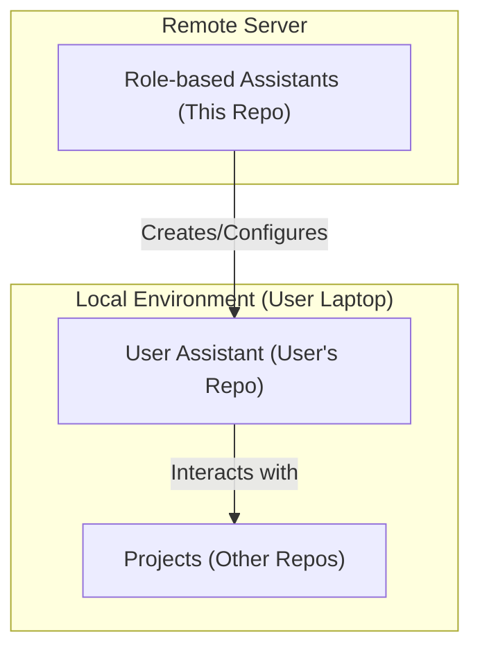

# Role-based Assistants

Role-based Assistants (RBA) is a framework to create, configure, and manage personalized AI assistants across different projects.

## Set up
In the `assistant/[user-assistant]` folder, copy the ai.json to your local folder
Run the following command to initialize the assistant:
```bash
npx asm install -t [your AI platform]
```
For example, if you want to use "claude", run ```npx asm init install -t claude```

### How to use
1. Ask the assistant to create a new project (if it doesn't exist)
2. Ask the assistant for your needs

## Architecture
### Diagram

### Flow

The framework is generic: every assistant is the **same machine** running different domain skills.
Two flows describe how it works at runtime. A specific assistant (BA, FE, BE, Designer, ...) just
plugs its own skills into the second flow.

**1. Session lifecycle & routing** — what happens when a chat starts. `gather-needs` is the single
entry point; it guards the working tree, detects intent, and routes to the right skill.


**2. The skill contract & 3-gate flow** — the universal pattern every domain skill follows. Each
skill declares its own contract (Inputs / Input AC / Outputs / Output Quality); the gates and the
shared skills (`commit-work`, `improve-skill`) are the same for all.


Together: flow 1 gets the user into the right skill; flow 2 is how that skill (and every other)
executes safely — never starting on bad input, never finishing on bad output, always committing
what's confirmed, and learning from any rework.
### User Assistant
This folder follows the following structure:
```text
.
├── .agent/, .cursor/, .claude/, ... # Configuration folder for IDE or platform
├── ai.json                          # AI settings: rules, skills, mcp, ...
├── AGENT.md                         # Agent definition
├── CLAUDE.md, ...                   # Link to AGENT.md
└── [project folders]/               # Individual projects
    ├── resource.md                # Project-specific resources such as name, working directory, knowledge
    ├── raw-conversation/    # Logs and transcripts of chat sessions
    └── in-progress-tasks/   # Manage in-progress tasks (Markdown files per task)
```
