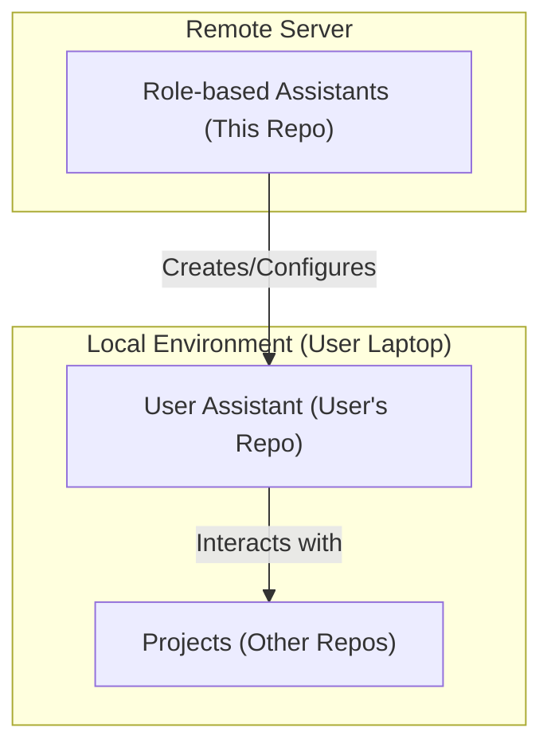
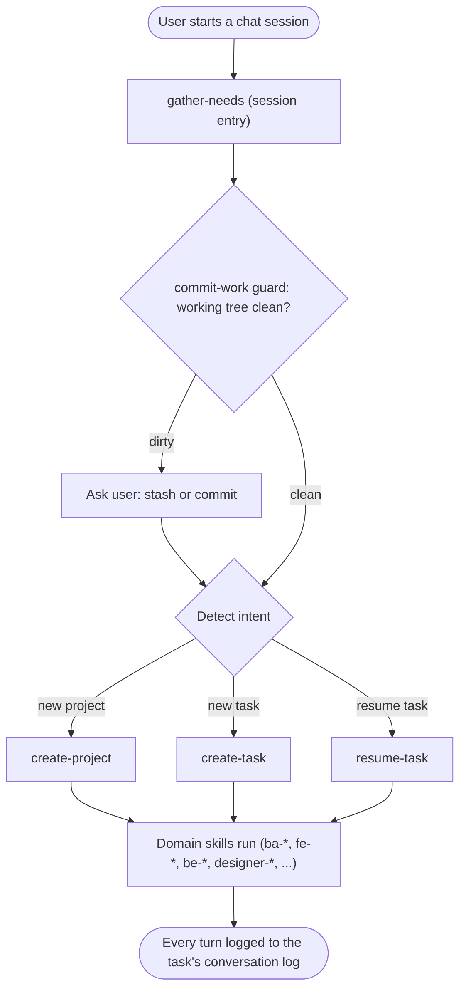
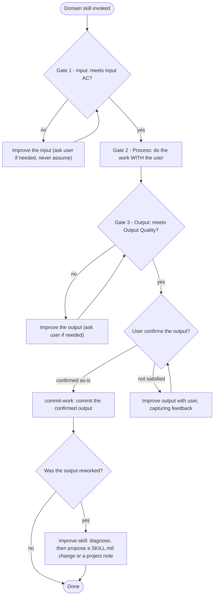

# Role-based Assistants

Role-based Assistants (RBA) is a framework to create, configure, and manage personalized AI assistants across different projects.

## Set up

### Prerequisites
Install the ASM CLI:
```bash
npm install -g agent-setting-manager
```

### Install an assistant
1. Create a folder for your assistant (e.g. `ba-assistant/`) and copy the `agent.json` from the relevant assistant in this repo into it:

   | Assistant | Source |
   |---|---|
   | BA Assistant | `assistants/ba-assistant/agent.json` |
   | Designer Assistant | `assistants/designer-assistant/agent.json` |
   | FE Assistant | `assistants/fe-assistant/agent.json` |

2. From that folder, run:
   ```bash
   asm install --target claude
   ```
   Replace `claude` with `cursor` or both (`claude cursor`) depending on your platform.

   ASM will fetch all skills and the agent file from GitHub and install them into the correct platform paths.

3. To update all artifacts to the latest version at any time:
   ```bash
   asm update
   ```
   
### Install via AI Agent

Copy one of the prompts below and send it directly to your AI agent (e.g. Claude). The agent will handle the installation for you.

**BA Assistant**
```
Install the BA Assistant into this folder using the ASM CLI.
1. If `asm` is not available, install it first: npm install -g agent-setting-manager
2. Download https://raw.githubusercontent.com/hoang-transperfect/role-based-agents/main/assistants/ba-assistant/agent.json and save it as agent.json in the current directory.
3. Run: asm install --target claude
```

**Designer Assistant**
```
Install the Designer Assistant into this folder using the ASM CLI.
1. If `asm` is not available, install it first: npm install -g agent-setting-manager
2. Download https://raw.githubusercontent.com/hoang-transperfect/role-based-agents/main/assistants/designer-assistant/agent.json and save it as agent.json in the current directory.
3. Run: asm install --target claude
```

Replace `claude` with `cursor` or both (`claude cursor`) if you use a different platform.

### How to use
1. Ask the assistant to create a new project (if it doesn't exist)
2. Ask the assistant for your needs

## Architecture
### Diagram

### Flow

The framework is generic: every assistant is the **same machine** running different domain skills.
Two flows describe how it works at runtime. A specific assistant (BA, FE, BE, Designer, ...) just
plugs its own skills into the second flow.

**1. Session lifecycle & routing** — what happens when a chat starts. `gather-needs` is the single
entry point; it guards the working tree, detects intent, and routes to the right skill.



**2. The skill contract & 3-gate flow** — the universal pattern every domain skill follows. Each
skill declares its own contract (Inputs / Input AC / Outputs / Output Quality); the gates and the
shared skills (`commit-work`, `improve-skill`) are the same for all.



Together: flow 1 gets the user into the right skill; flow 2 is how that skill (and every other)
executes safely — never starting on bad input, never finishing on bad output, always committing
what's confirmed, and learning from any rework.
### User Assistant
This folder follows the following structure:
```text
.
├── .agent/, .cursor/, .claude/, ... # Configuration folder for IDE or platform
├── agent.json                       # AI settings: rules, skills, mcp, ...
├── AGENT.md                         # Agent definition
├── CLAUDE.md, ...                   # Link to AGENT.md
└── projects/                        # One index file per project
    └── [project-slug].md            # Pointer to the real project (real_project_path) + in-progress task list
```

Everything else lives in the **real project**: the assistant's artifacts folder plus the
assistant's output of work:
```text
[real project]/
├── [assistant-name]-artifacts/      # All the assistant's project content, named after the assistant
│   ├── resource.md                  # Project resources (links + descriptions) and notes
│   └── tasks/
│       └── [task-id]/               # One folder per task
│           ├── task.md              # Task description, status, and plan
│           ├── conversation.md      # Verbatim conversation log
│           └── ...                  # The task's working artifacts
└── [output of work]                 # The assistant's deliverable to other teams — role-specific:
```
