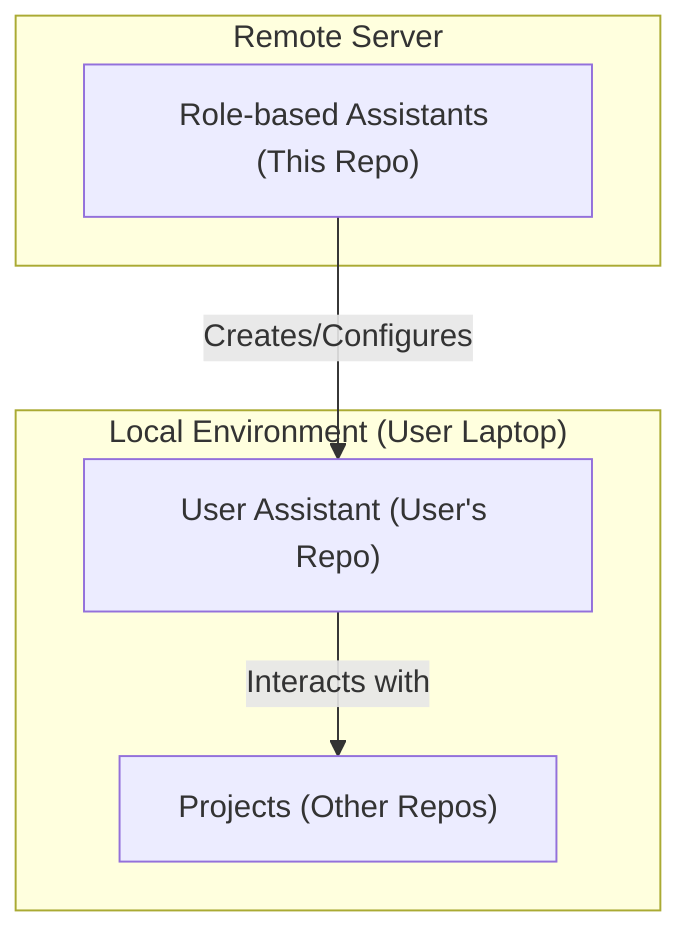

# Role-based Assistants

Role-based Assistants (RBA) is a framework to create, configure, and manage personalized AI assistants across different projects and organizational levels.

## Set up
In the `assistant/[user-assistant]` folder, copy the ai.json to your local folder
Run the following command to initialize the assistant:
```bash
npx asm install -t [your AI platform]
```
For example, if you want to use "claude", run ```npx asm init install -t claude```

### How to use
1. Ask the assistant to create a new project (if it doesn't exist)
2. Ask the assistant for your needs

## Architecture
### Diagram


### User Assistant
This folder follows the following structure:
```text
.
├── .agent/, .cursor/, .claude/, ... # Configuration folder for IDE or platform
├── ai.json                          # AI settings: rules, skills, mcp, ...
├── AGENT.md                         # Agent definition
├── CLAUDE.md, ...                   # Link to AGENT.md
├── project.json                     # Project list including project name, in-progress tasks (status, description)
└── [enterprise folders]/            # Organizations or departments
    ├── resource.json                # Shared resources such as knowledge for the enterprise
    └── [team folders]/              # Specific teams within the enterprise
        ├── resource.json            # Team-specific resources such as knowledge
        └── [project folders]/       # Individual projects managed by the team
            ├── resource.json        # Project-specific resources such as knowledge
            ├── raw-conversation/    # Logs and transcripts of chat sessions
            └── in-progress-tasks/   # Manage in-progress tasks (Markdown files per task)
```
