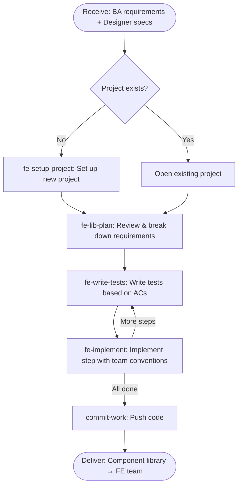

# fe-build-component-lib

**Receive:** BA requirements + Designer specs  
**Deliver:** Component library → FE team

## Pipeline

| # | Input | Action | Output | Skill |
|---|-------|--------|--------|-------|
| 1 | BA requirements + Designer specs | Set up project if new (skip if existing) | Ready project environment | `fe-setup-project` *(new only)* |
| 2 | Ready project + BA requirements + Designer specs | Review requirements & break down into steps | Task breakdown | `fe-lib-plan` |
| 3 | Task breakdown | Write tests based on ACs (per step/component) | Test suite | `fe-write-tests` |
| 4 | Test suite | Implement each step with team conventions (tests must pass before done) | Verified code | `fe-implement` |
| 5 | Verified code | Push code | Component library → FE team | `commit-work` |

## Flowchart

