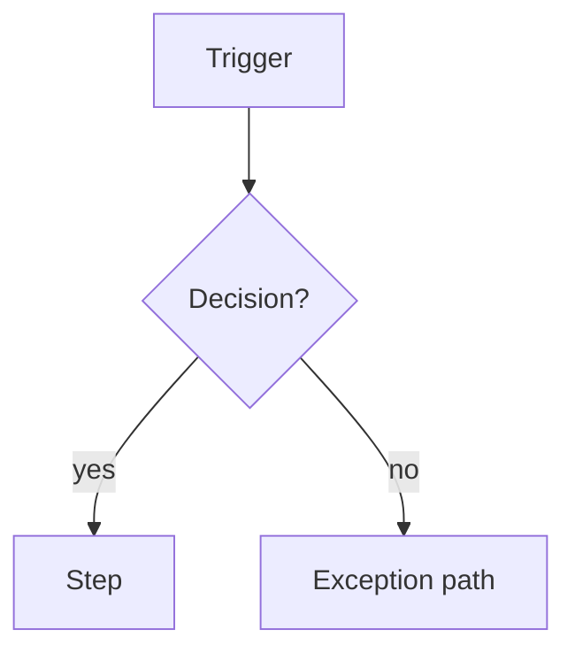
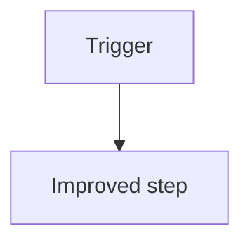

# ba-model

Requirements that don't trace to a change in how work actually happens tend to be solutions in
search of a problem. This skill makes that link explicit: it models the **As-Is** process (how the
business works today, pain and workarounds included), designs the **To-Be** process (how it should
work to meet the objectives), and derives the **gap** — and every gap implies the requirements that
close it. That gap analysis is the bridge from raw findings to a defensible requirement set.

It's optional by design: only process-shaped efforts need it. `ba-plan` decides whether it applies.

## Where things live

- Read `real_project_path` from the project's index file
  (`<assistant-folder>/projects/<project-slug>.md`).
- Write the deliverable to
  `<real_project_path>/ba-assistant-artifacts/tasks/<task-id>/process-models.md`.
- Tick the process-modelling step in the task file's `## Plan` checklist when confirmed.

---

## The skill contract

### Inputs
- The `elicitation/findings-log.md` from `ba-elicit` — how the process works today, and its pain.
- The `related-context.md` artifact — any existing process documentation.
- The business problem and **objectives** from the Plan — the To-Be must serve them.

### Input Acceptance Criteria
- The effort genuinely **involves a business process** — a sequence of activities across roles
  and/or systems. If it isn't process-shaped (a static data requirement, a component library), this
  skill should be **skipped** — say so and note it in the plan rather than forcing a model.
- There are enough findings to describe the **current** process. If the As-Is is largely unknown,
  more elicitation or observation is needed first — hand back to `ba-elicit`. Never invent the
  current process from assumption.

### Outputs
- `process-models.md` — the As-Is process (mermaid), the To-Be process (mermaid), and a gap
  analysis table mapping each As-Is→To-Be change to the requirement(s) it implies.

### Output Quality Criteria
- **As-Is reflects reality, not the ideal** — including the workarounds, manual steps, and pain
  points people actually live with. Model only what was elicited or observed; mark anything unknown
  as unknown. Never invent steps to make the diagram tidy.
- **To-Be traces to the objectives** — every change from As-Is serves a stated goal. Change with no
  objective behind it is a flag to re-examine, not to model.
- **The gap is explicit** — each difference between As-Is and To-Be is listed with the
  requirement(s) it implies. This table is the hand-off to `ba-analyse`; a model with no gap
  analysis is incomplete.
- **Actors and systems are visible** — use swimlanes where crossing roles/systems aids clarity —
  and **hand-offs and decision points are explicit**, because that's where processes break and
  requirements hide.
- **Exception and alternate paths are modelled**, not just the happy path — the exception branches
  are usually where the real requirements live.
- Diagrams are **valid, readable mermaid**.

## Techniques available
Flowcharts for sequence, cross-functional **swimlane** diagrams when responsibilities span roles,
value-stream thinking to spot waste/bottlenecks, and gap analysis to turn the As-Is→To-Be delta
into requirements. Pick what the process needs.

---

## The 3-gate flow

### Gate 1 — Input
Read inputs, check against Input Acceptance Criteria. If the work isn't process-shaped, recommend
skipping; if the As-Is is unknown, hand back to `ba-elicit`. **Ask, never assume.** (Tree already
clean from the session-start guard.)

### Gate 2 — Process
Walk the current process **with** the user, step by step: trigger, actors, systems, decisions,
hand-offs, and where it hurts. Then design the To-Be to meet the objectives, and derive the gap.
Draft:

```markdown
# Process Models — <process name>
_Modelled: <date> · Work mode: <from-scratch / develop / maintain>_

## As-Is — current process
<short narrative: trigger, actors, the pain points and workarounds>


## To-Be — proposed process
<short narrative: what changes and which objective each change serves>


## Gap analysis
| # | Change (As-Is → To-Be) | Why (objective served) | Requirement(s) implied |
|---|------------------------|------------------------|------------------------|
| 1 | <what's different> | <objective> | <new / changed requirement → ba-analyse> |
```

### Gate 3 — Output
Check against the Output Quality Criteria — especially that the As-Is is honest, the To-Be traces
to objectives, and every gap names the requirement it implies. Improve if short of the bar (ask the
user where you need their knowledge; never assume). When it meets the bar:
1. Present and ask the user to confirm.
2. **If confirmed** → write `process-models.md`, tick the process-modelling step in `## Plan`
   (link + **Next step**), then hand off to `commit-work` (real project repo).
3. **If not satisfied** → improve with the user until confirmed, commit, then hand off to
   `improve-skill`.

You author the models as the BA assistant, on the user's behalf, for the audit record.

---

## Handoff
The gap analysis feeds `ba-analyse` (Steps 5–6): each implied requirement enters validation and
prioritisation. The To-Be process also informs the **functional user flow** `ba-document` records
at feature level — keep them aligned.
